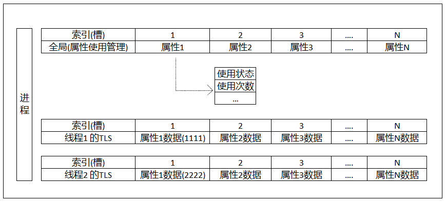
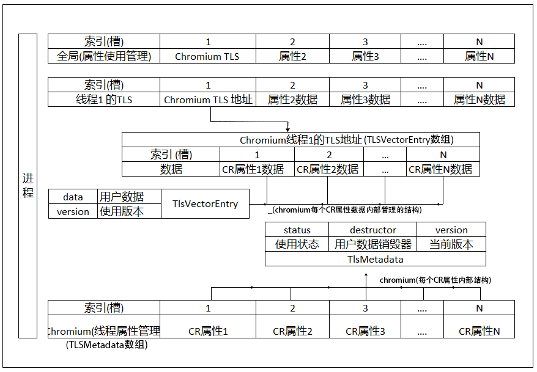

### 线程局部储存(Thread-Local-Storage,TLS)  
#### 概述  
&emsp;&emsp;在多线程编程中, 到处都能看到TLS的影子(例如:线程命名, 线程循环, 线程内存使用统计等), 通常多个线程有共同的属性, 但是属性值由每个线程独立管理使用的时候就会用到它, 主要目的就是减少或者避免锁的使用, 想象一下所有个线程都只能在一个全局的线程命名数组里排队设置或寻找自己的名字, 效率多感人。在Windows系统下TLS的设计思想大概是这样的(其他的系统也应该差不多):  
  
总结一下有以下几点:  
- 进程管理着所有线程属性的使用状态。
- 每个线程都有自己的私有空间。
- 所有线程都通过进程分配的索引(chromium里设计成槽对象)来获取设置对应的属性值(即使线程是在索引分配后创建的也不会受到影响)。
  
通过TLSAlloc来分配索引传递给TLSGet(Set)Value来读写属性值, 这是就是典型的空间换时间!!

#### Chromium的TLS
&emsp;&emsp;从上面的设计图可以看到线程的TLS空间范围是系统自定的, 在不同的平台下极有可能是不一致的, 这也会影响软件的跨平台稳定性, 因此Chromium基于系统的TLS(只用了一个索引)自己包装了一套应用层的TLS, 设计思想也跟上面的差不多, 只不过它把索引换成一个槽对象(里面包含了索引, 索引的使用版本,其实就是使用次数), 这样它就可以保证每个平台下的线程TLS空间是一致的。它的设计大概就下面这样的:  
  
具体来说做了这么些事情:
- 跟进程申请了一个TLS索引来在线程里储存在它自己的TlsVerctorEntry数组地址。
- 申明了一个TlsMetadata类型的全局数组, 注册槽的时候通过它来初始化槽的索引以及版本号。
- 使用槽来设置或者获取线程变量 它先通过跟进程申请来的TLS索引来找到或者创建对应线程的TlsVerctorEntry数组, 然后再通过槽的索引来找到对应的TlsVerctorEntry并且对data进行读写, 如果槽版本跟找到的TlsVerctorEntry里的版本对不上的话就说明这个槽过期了, 操作就会不成功。
- 注册了线程销毁回调, 线程销毁的时候, 找个每个TlsVerctorEntry成员对应的TlsMetadata, 通过destructor来释放用用户数据(如果在申请这个槽的时候提供了用户数据销毁方法的话), 然后释放该线程下的TlsVerctorEntry数组。
- 在用完释放了一个槽后, 这个槽对应的TlsMetadata的使用版本将会 +1

#### 使用Chromium的TLS
&emsp;&emsp;Chromium的TLS操作设计的很完美也很简单, 我们只需要关心槽的申明和使用就可以了。下面是一个使用Chromium的槽实现的统计线程内存的例子:  
```c++
#include <iostream>
#include <string>
#include <thread>

#include "winbase/macros.h"
#include "winbase/threading/thread_local.h"
#include "winbase/threading/thread_local_storage.h"
#include "winbase/win/import_lib.cc"  // 导入系统静态库

////////////////////////////////////////////////////////////////////////////////

class ThreadLocalMemoryUsage {
 public:
  struct Info {
    std::string name;
    size_t alloc_bytes;
    size_t free_bytes;

    // 提供给线程退出的时候调用
    static void OnDelete(void* ptr) {
      Info* info = static_cast<Info*>(ptr);

      std::cout 
          << "thread_name:" << info->name << ", "
          << "alloc_bytes:" << info->alloc_bytes << ", "
          << "free_bytes:" << info->free_bytes << ","
          << (info->alloc_bytes > info->free_bytes ? "leaked" : "safety") 
          << std::endl;
      delete info; 
    }
  };

  Info* Get() { return static_cast<Info*>(slot_.Get()); }
  void Set(Info* info) { slot_.Set(info); }

 private:
  winbase::ThreadLocalStorage::Slot slot_{Info::OnDelete};
};

////////////////////////////////////////////////////////////////////////////////

// 要保证所有用这个槽的线程的生命周期比这个槽短
// 因此槽通常是申明成全局的
ThreadLocalMemoryUsage g_tls_mem;

void thread_proc_inner(bool do_leak) {
  // 读取线程数据
  ThreadLocalMemoryUsage::Info* info = g_tls_mem.Get();
  if (info != nullptr) {
    char* mem = new char[16];
    info->alloc_bytes += 16;
    if (!do_leak) {
      delete[] mem;
      info->free_bytes += 16;
    }
  }
}

void thread_proc(ThreadLocalMemoryUsage::Info* info, bool do_leak) {
  // 先给线程设置数据
  g_tls_mem.Set(info);

  for (int i = 0; i < 5; i++) {
    thread_proc_inner(do_leak);
  }
}

////////////////////////////////////////////////////////////////////////////////

int main(int argc, char* argv[]) {
  // 运行一个内存安全的线程
  ThreadLocalMemoryUsage::Info* t1 = new ThreadLocalMemoryUsage::Info;
  t1->name = "Lili";
  t1->alloc_bytes = 0;
  t1->free_bytes = 0;
  std::thread thread1(thread_proc, t1, false);

  // 运行一个内存泄漏的线程
  ThreadLocalMemoryUsage::Info* t2 = new ThreadLocalMemoryUsage::Info;
  t2->name = "xiaohong";
  t2->alloc_bytes = 0;
  t2->free_bytes = 0;
  std::thread thread2(thread_proc, t2, true);

  // 运行一个内存泄漏的线程
  ThreadLocalMemoryUsage::Info* t3 = new ThreadLocalMemoryUsage::Info;
  t3->name = "gouzi";
  t3->alloc_bytes = 0;
  t3->free_bytes = 0;
  std::thread thread3(thread_proc, t3, true);

  thread1.join();
  thread2.join();
  thread3.join();

  system("pause");
  return 0;
}
``` 
打印结果:  
```
thread_name:Lili, alloc_bytes:80, free_bytes:80,safety
thread_name:xiaohong, alloc_bytes:80, free_bytes:0,leaked
thread_name:gouzi, alloc_bytes:80, free_bytes:0,leaked
Press any key to continue . . .
```
如果你在线程里用的数据是简单的char, short, int, void*类型, 那么你简单的使用ThreadLocalPointer<Type>就够了。  
&emsp;&emsp;&emsp;&emsp;&emsp;&emsp;&emsp;&emsp;&emsp;&emsp;&emsp;&emsp;&emsp;&emsp;&emsp;&emsp;&emsp;&emsp;&emsp;&emsp;&emsp;&emsp;&emsp;&emsp;&emsp;&emsp;&emsp;&emsp;&emsp;&emsp;&emsp;&emsp;&emsp;&emsp;&emsp;&emsp;&emsp;-2022/12/05 